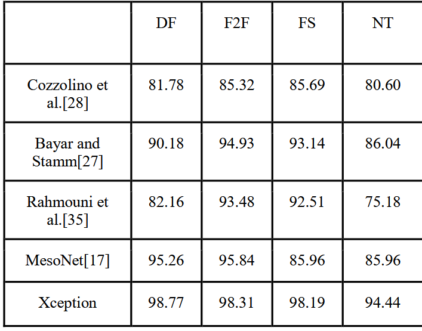

# DeepFakeX

<p align="center">
  
</p>

## 🚀 Overview

DeepFakeX is a cutting-edge deepfake detection system that leverages state-of-the-art deep learning models to identify manipulated media. The project combines the power of the Xception architecture with a modern web interface to provide an accessible tool for detecting deepfakes.

## ✨ Features

- **High Accuracy Detection**: Achieves industry-leading performance metrics with up to 98.77% accuracy on deepfake detection
- **Real-time Analysis**: Process images and videos for immediate deepfake detection
- **Modern Web Interface**: User-friendly frontend for easy interaction with the detection engine
- **API Access**: RESTful API for integration with other applications
- **Multiple Model Support**: Extensible architecture that supports various detection models

## 📊 Performance Metrics

As shown in the comparison table above, DeepFakeX (implemented as the Xception model) outperforms other state-of-the-art models across all testing datasets:

- **DF (DeepFakes)**: 98.77% accuracy
- **F2F (Face2Face)**: 98.31% accuracy
- **FS (FaceSwap)**: 98.19% accuracy
- **NT (NeuralTextures)**: 94.44% accuracy

## 🛠️ Technology Stack

### Frontend
- React.js
- TailwindCSS
- Vite

### Backend
- Node.js
- Express.js
- MongoDB
- Flask API for ML model serving

### Machine Learning
- PyTorch
- Xception CNN Architecture
- Image processing libraries

## 🔧 Installation

### Prerequisites
- Node.js (v14+)
- Python 3.8+
- PyTorch
- MongoDB

### Setup

1. **Clone the repository**
   ```
   git clone https://github.com/yourusername/DeepFakeX.git
   cd DeepFakeX
   ```

2. **Set up the server**
   ```
   cd server
   npm install
   ```

3. **Set up the client**
   ```
   cd client
   npm install
   ```

4. **Set up the ML environment**
   ```
   pip install -r requirements.txt
   ```

5. **Configure environment variables**
   - Create `.env` files in both client and server directories following the provided examples

## 🚀 Usage

1. **Start the server**
   ```
   cd server
   npm start
   ```

2. **Start the Flask API**
   ```
   python Deep-Fake-Detection-FlaskAPI.py
   ```

3. **Start the client**
   ```
   cd client
   npm run dev
   ```

4. **Access the application**
   - Open your browser and navigate to `http://localhost:5173`

## 📁 Project Structure

```
DeepFakeX/
├── client/               # React frontend
├── server/               # Node.js backend
├── Deep-Fake-Detection-FlaskAPI.py  # ML model API
├── xception_best.pth     # Trained model weights
├── uploads/              # Temporary storage for uploads
└── Deep-Fake Additional Modules/  # Additional ML components
```

## 🤝 Contributing

Contributions are welcome! Please feel free to submit a Pull Request.

1. Fork the repository
2. Create your feature branch (`git checkout -b feature/amazing-feature`)
3. Commit your changes (`git commit -m 'Add some amazing feature'`)
4. Push to the branch (`git push origin feature/amazing-feature`)
5. Open a Pull Request

## 📄 License

This project is licensed under the MIT License - see the LICENSE file for details.

## 📞 Contact

For questions and support, please open an issue in the GitHub repository.

---

<p align="center">
  Made with ❤️ by the DeepFakeX Team
</p> 